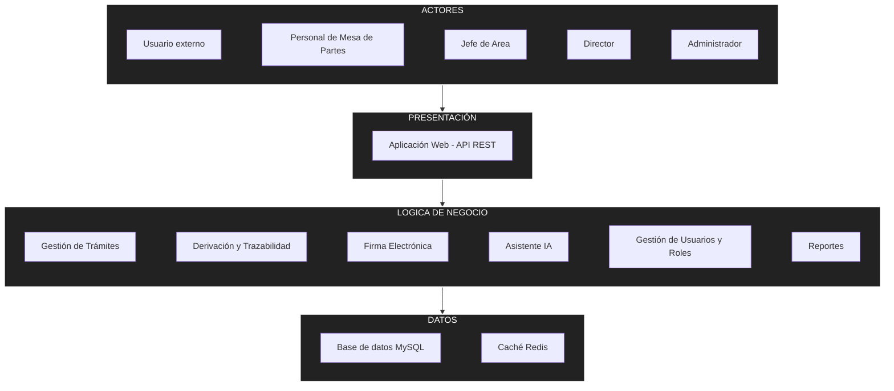

# Diagrama de arquitectura por bloques

Sistema de Mesa de Partes Digital — Instituto Manuel Antonio Hierro Pozo

```mermaid
flowchart TD

subgraph ACTORES["ACTORES"]
    UE["Usuario externo"]
    PMP["Personal de Mesa de Partes"]
    JA["Jefe de Area"]
    DIR["Director"]
    ADM["Administrador"]

end

subgraph PRESENTACION["PRESENTACIÓN"]
    Web["Aplicación Web - API REST"]
end

subgraph NEGOCIO["LOGICA DE NEGOCIO"]
    Tramites["Gestión de Trámites"]
    Derivacion["Derivación y Trazabilidad"]
    Firma["Firma Electrónica"]
    IA["Asistente IA"]
    Usuarios["Gestión de Usuarios y Roles"]
    Reportes["Reportes"]
end

subgraph DATOS["DATOS"]
    BD["Base de datos MySQL"]
    Cache["Caché Redis"]
end

ACTORES --> PRESENTACION
PRESENTACION --> NEGOCIO
NEGOCIO --> DATOS

UE ~~~ PMP
PMP ~~~ JA
JA ~~~ DIR
DIR ~~~ ADM
Tramites ~~~ Derivacion
Derivacion ~~~ Firma
Firma ~~~ IA
IA ~~~ Usuarios
Usuarios ~~~ Reportes
BD ~~~ Cache

style ACTORES fill:#222,stroke:#fff,stroke-width:2px,color:#fff
style PRESENTACION fill:#222,stroke:#fff,stroke-width:2px,color:#fff
style NEGOCIO fill:#222,stroke:#fff,stroke-width:2px,color:#fff
style DATOS fill:#222,stroke:#fff,stroke-width:2px,color:#fff
```

