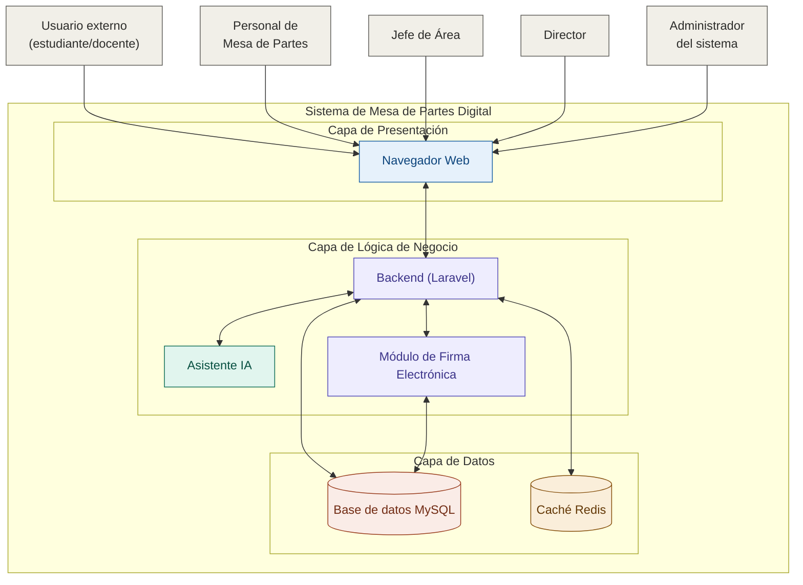

# Diagrama de arquitectura completa

Sistema de Mesa de Partes Digital — Instituto Manuel Antonio Hierro Pozo

```mermaid
flowchart TB
    UE["Usuario externo<br/>(estudiante/docente)"]
    PMP["Personal de<br/>Mesa de Partes"]
    JA["Jefe de Área"]
    DIR["Director"]
    ADM["Administrador<br/>del sistema"]

    subgraph SISTEMA["Sistema de Mesa de Partes Digital"]
        direction TB
        subgraph L1["Capa de Presentación"]
            WEB["Navegador Web"]
        end

        subgraph L2["Capa de Lógica de Negocio"]
            BACK["Backend (Laravel)"]
            IA["Asistente IA"]
            FIRMA["Módulo de Firma Electrónica"]
        end

        subgraph L3["Capa de Datos"]
            DB[("Base de datos MySQL")]
            CACHE[("Caché Redis")]
        end

        WEB <--> BACK
        BACK <--> IA
        BACK <--> FIRMA
        BACK <--> DB
        BACK <--> CACHE
        FIRMA <--> DB
    end

    UE --> WEB
    PMP --> WEB
    JA --> WEB
    DIR --> WEB
    ADM --> WEB

    classDef actor fill:#F1EFE8,stroke:#5F5E5A,color:#2C2C2A;
    classDef pres fill:#E6F1FB,stroke:#185FA5,color:#0C447C;
    classDef logic fill:#EEEDFE,stroke:#534AB7,color:#3C3489;
    classDef ia fill:#E1F5EE,stroke:#0F6E56,color:#085041;
    classDef data fill:#FAECE7,stroke:#993C1D,color:#712B13;
    classDef cache fill:#FAEEDA,stroke:#854F0B,color:#633806;

    class UE,PMP,JA,DIR,ADM,VER actor;
    class WEB pres;
    class BACK,FIRMA logic;
    class IA ia;
    class DB data;
    class CACHE cache;
```